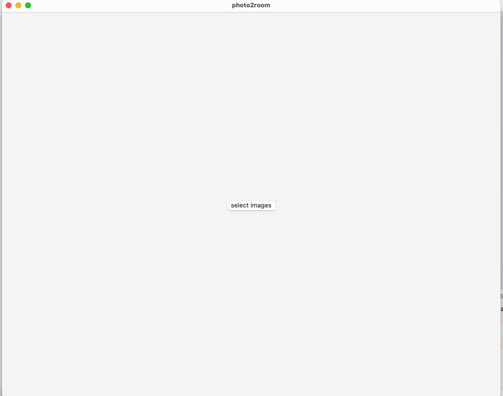
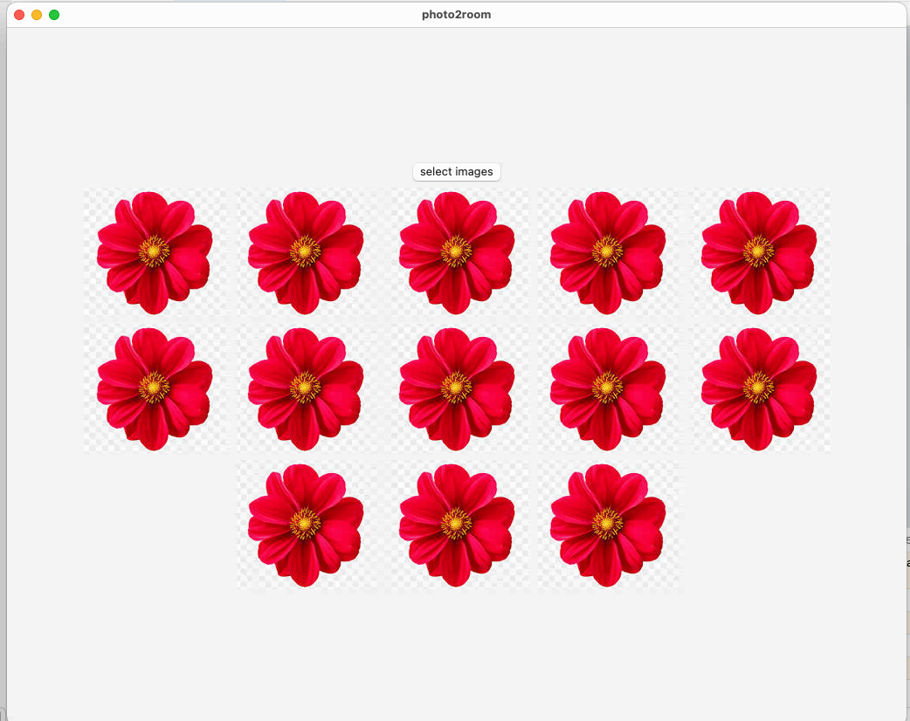

# Display a grid of images on macOS
Simplest swift macOS app for selecting files and displaying images in a grid.

Uses: SwiftUI, QuickLook, QuickLookUI, AppKit. (NSOpenPanel, NSImage)

Functionality:
1. Button to open a file browsing panel.
2. Selecting files in the panel.
2. Reading data from the files as NSImage data.
3. Displaying loaded images in a grid.
4. Clicking the button and repeating the process for reselection. 

App views:
1. Blank with a button.

2. Displaying selected image files.

